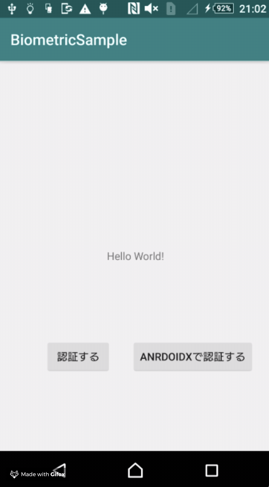
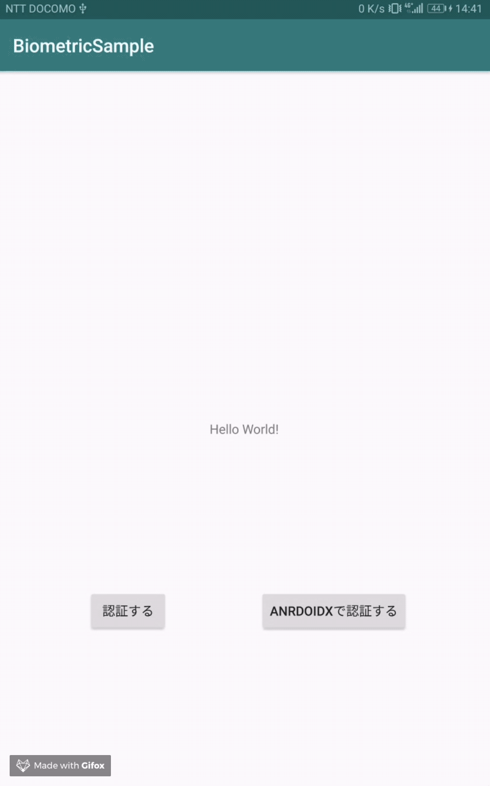
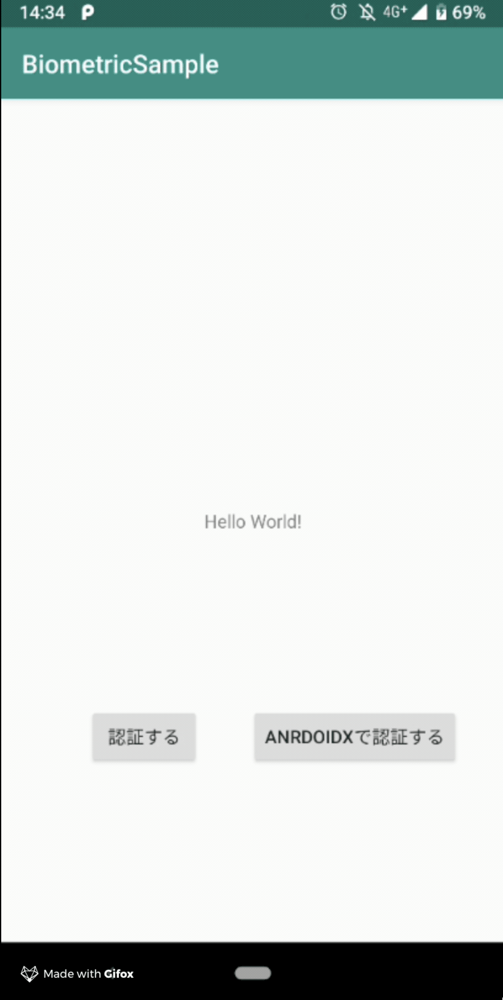

# BiometricPrompt Sample

- using android.hardware.biometrics.BiometricPrompt
- also using androidx.biometric.BiometricPrompt

# Usage

## API21

has no sensor.

## API26

has sensor.

## API28

has sensor.

# License

MIT
